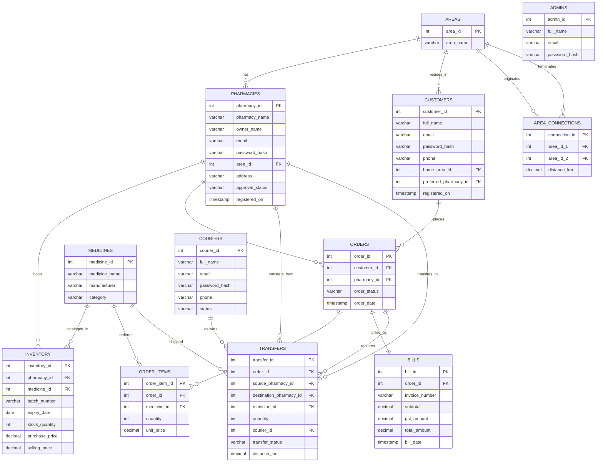
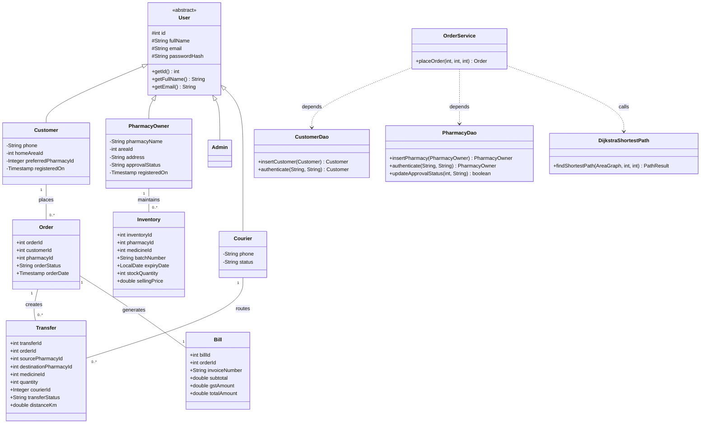
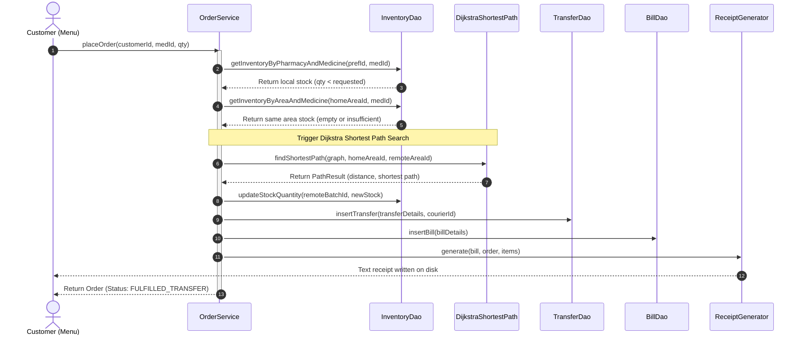
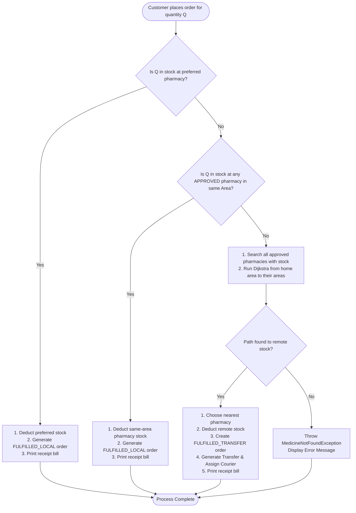
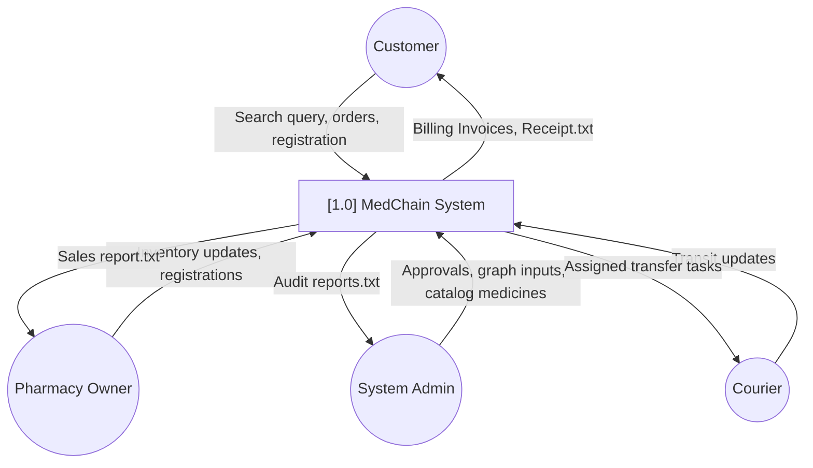
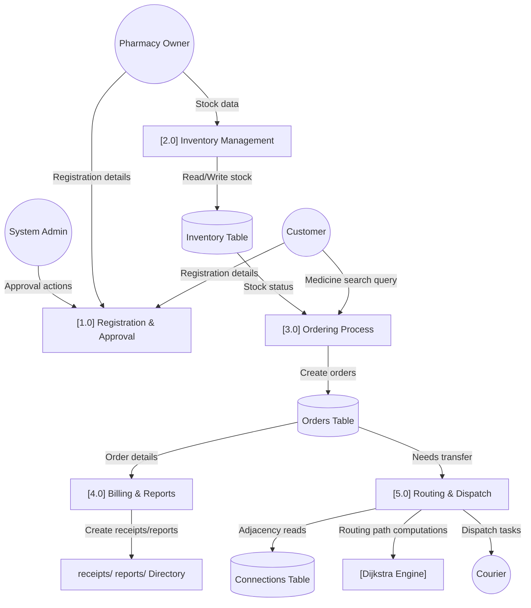
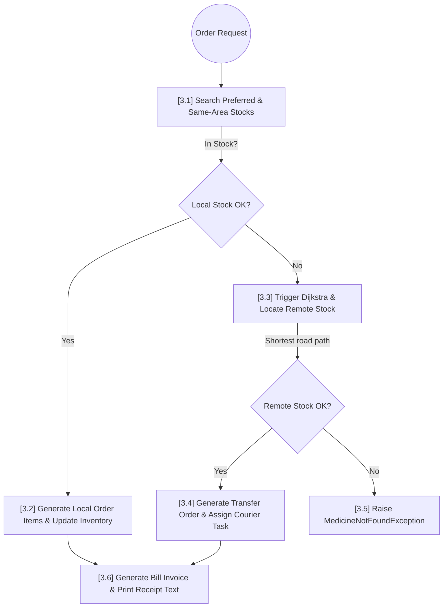

# MedChain — Decentralized Pharmacy Network Management System

MedChain is a Core Java console application connecting to MySQL via JDBC. It models a decentralized pharmacy network that manages inventory, handles order branching, automates inter-pharmacy stock transfers using Dijkstra's shortest path, and implements manual Binary Search Tree (BST) sorting for medicine expiry checking.

---

## SETUP & EXECUTION INSTRUCTIONS

Follow these steps to compile and run the application on your local machine:

### 1. Database Setup
1. Open **XAMPP Control Panel** and start the **Apache** and **MySQL** services.
2. Open your web browser and go to: `http://localhost/phpmyadmin`
3. Click on the **SQL** tab.
4. Copy the entire contents of [schema.sql](file:///schema.sql) and execute it. This will create the database `medchain_db` and seed it with all necessary geographical areas, connections, admin accounts, couriers, pharmacies, customer profiles, and medicine inventories.

### 2. Properties Configuration
Verify the MySQL credentials inside the `db.properties` file located at the project root. The default configuration connects to:
- **Host**: `localhost:3306`
- **Username**: `root`
- **Password**: *(empty)*

### 3. Placing the JDBC Driver
Download the MySQL Connector/J driver `.jar` file and place it inside the `lib/` directory at the project root. For example:
`C:\Users\lenovo\.gemini\antigravity-ide\scratch\MedChain\lib\mysql-connector-j-8.x.x.jar`

### 4. Compilation
- **Windows**: Double-click [compile.bat](file:///compile.bat) or execute it in PowerShell/Command Prompt.
- **Unix/Linux**: Run `./compile.sh` in the terminal.

### 5. Running the Application
- **Windows**: Double-click [run.bat](file:///run.bat) or execute `run.bat` in PowerShell/Command Prompt.
- **Unix/Linux**: Run `./run.sh` in the terminal.

---

## PACKAGE ARCHITECTURE SUMMARY

| Package | Purpose |
|---|---|
| `com.medchain.main` | Single entry point (`Main.java`). boots connection and runs the root portal loop. |
| `com.medchain.model` | Domain POJOs mapping MySQL tables. Utilizes inheritance (`User` base class). |
| `com.medchain.dao` | Data Access Objects containing all JDBC `PreparedStatement` query/insert execution logic. |
| `com.medchain.service` | Business logic orchestrator (transaction bounds, order branching, Dijkstra routing). |
| `com.medchain.menu` | UI Layer holding role-based console scanner input menus (`CustomerMenu`, `PharmacyMenu`, etc.). |
| `com.medchain.exception` | Custom checked exceptions representing business failures (e.g. `StockOutException`). |
| `com.medchain.util` | Utilities (JDBC Singleton `DBConnection`, `PasswordUtil` hashing, `GSTCalculator`, validation). |
| `com.medchain.algorithm` | Shortest path finder (`DijkstraShortestPath`) and graph adjacency mapping (`AreaGraph`). |
| `com.medchain.ds` | Manual sorting structure (`MedicineExpiryBST` and `BSTNode`) sorting inventory by expiry date. |
| `com.medchain.report` | Text report writers (`ReceiptGenerator`, `SalesReportGenerator`, `AuditReportGenerator`). |

---

## ARCHITECTURAL DIAGRAMS

### 1. Entity Relationship (ER) Diagram

### 2. Class Diagram

### 3. Use Case Diagram

```mermaid
flowchart TB
    subgraph CustomerUseCases["Customer Actions"]
        C1["Register Customer Account"]
        C2["Search Medicine Catalog"]
        C3["View Prices across Pharmacies"]
        C4["Place Medicine Order"]
        C5["View Personal Order History / Invoices"]
    end

    subgraph PharmacyUseCases["Pharmacy Actions"]
        P1["Register Pharmacy Profile"]
        P2["Add Inventory Batches"]
        P3["Update Stock / Prices"]
        P4["View Near Expiry Medicines"]
        P5["Generate Sales Summary Report"]
    end

    subgraph AdminUseCases["Admin Actions"]
        A1["Approve Pending Pharmacies"]
        A2["Configure Areas & Distance Graph"]
        A3["Register Catalog Medicine"]
        A4["Register Courier Account"]
        A5["Generate Global Audit Logs"]
    end

    subgraph CourierUseCases["Courier Actions"]
        R1["View Assigned Deliveries"]
        R2["Update Transfer Status (Delivered)"]
    end

    CustomerActor((Customer)) --> C1
    CustomerActor --> C2
    CustomerActor --> C3
    CustomerActor --> C4
    CustomerActor --> C5

    PharmacyActor((Pharmacy Owner)) --> P1
    PharmacyActor --> P2
    PharmacyActor --> P3
    PharmacyActor --> P4
    PharmacyActor --> P5

    AdminActor((Admin)) --> A1
    AdminActor --> A2
    AdminActor --> A3
    AdminActor --> A4
    AdminActor --> A5

    CourierActor((Courier)) --> R1
    CourierActor --> R2
```

### 4. Sequence Diagram: Order Placement with Transfer Fallback

### 5. Activity Diagram: Branching Fulfillment Logic

### 6. Data Flow Diagram (DFD) Level 0: System Context

### 7. Data Flow Diagram (DFD) Level 1: Key Operations

### 8. Data Flow Diagram (DFD) Level 2: Ordering Fulfill Detail

